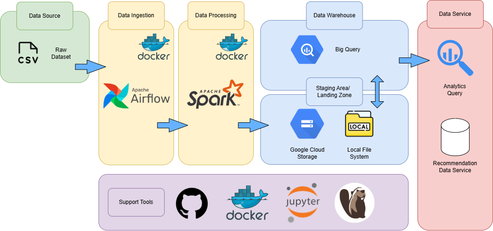

# TMDB Recommendation Flow

**Author**: Mr. Polakorn Anatapakorn  
**Role**: Data Engineer Intern, Bluebik Vulcan

---

## Description

TMDB Recommendation Flow is a modern data pipeline project designed to automate and streamline movie recommendation dataset generation using **Apache Airflow**, **Apache Spark**, and **Google Cloud Platform (BigQuery)**. The pipeline processes TMDB movie data through several ETL stages—cleansing, transformation, exporting, and modeling—to produce ready-to-use data for recommendation systems.

---

## Project Overview

The pipeline is orchestrated using **Airflow DAGs**, processes data using **Apache Spark**, and stores it in **BigQuery**. Output can be used for content-based or collaborative filtering movie recommendation systems.

---

## Table of Contents

- [Project Overview](#project-overview)
- [Project Structure](#project-structure)
- [Architecture Overview](#architecture-overview)
- [Tools & Versions](#tools--versions)
- [Installation](#installation)
- [Usage](#usage)
- [Airflow Connection](#airflow-connection)
- [Credits & Use Case](#credits--use-case)
- [Python Dependencies](#python-dependencies)
- [License](#license)

---

## Project Structure

```
TMDB_RecoFlow/
├── airflow/                 # Contains Airflow DAGs and utility scripts
├── spark/                   # Spark ETL scripts for preprocessing and transformation
├── eda/                     # Jupyter notebooks for data exploration and modeling
├── model/                   # Modeling scripts for recommendations
├── Dockerfile               # Dockerfile for Airflow and Spark services
├── Dockerfile.jupyter       # Dockerfile for JupyterLab with PySpark
├── docker-compose.yml       # Orchestration of all services
├── requirements.txt         # Python dependencies
```

---

## Architecture Overview


---

## Tools & Versions

-   
  via provider: `apache-airflow-providers-apache-spark==4.3.0`

- 

- 

- 

- 

-   
  

---

## Installation

### Prerequisites
- Docker & Docker Compose
- GCP service account credentials (for BigQuery & GCS)

### Steps

```bash
# Clone the repository
git clone https://github.com/6587093polakornming/TMDB_RecoFlow.git
cd TMDB_RecoFlow

# Copy and configure your environment variables
cp example.env .env

# Build and start the services
docker-compose up --build
```

Ensure your GCP credentials and environment variables (e.g., project ID, bucket name) are correctly configured in `.env`.

---

## Usage

1. **Airflow UI**:
   - Access at `http://localhost:8080`
   - Trigger DAGs manually or set a schedule

2. **Workflow Path**:
   - Airflow DAGs: `airflow/dags/`
   - Spark Scripts: `spark/app/`
   - Notebooks: `eda/`

3. **ETL Process**:
   - Ingest and validate movie data
   - Clean and transform using Spark
   - Export to BigQuery
   - Run model to generate recommendations

---

## Airflow Connection

Airflow uses SparkSubmitOperator with this connection string:

```bash
spark://spark-master:7077
```

This is defined in `docker-compose.yml`.

---

## Credits & Use Case

- **Dataset**: [TMDB Movies Dataset - Daily Updates](https://www.kaggle.com/code/asaniczka/tmdb-movies-daily-updates)
- **Use Case Reference**: [Recommendation System by moridata](https://www.kaggle.com/code/moridata/recommendation-system-movie-recommendation)

---

## Python Dependencies

Install locally (if needed outside Docker):

```bash
pip install --no-cache-dir \
  "apache-airflow-providers-apache-spark==4.3.0" \
  "apache-airflow-providers-google" \
  "google-cloud-bigquery" \
  "pyarrow" \
  "fastparquet"
```

---

## License

This project is licensed under the **MIT License**. See the `LICENSE` file for more details.
